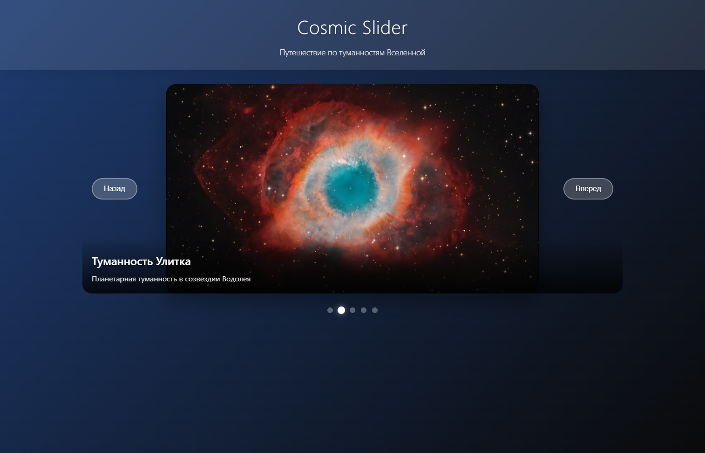
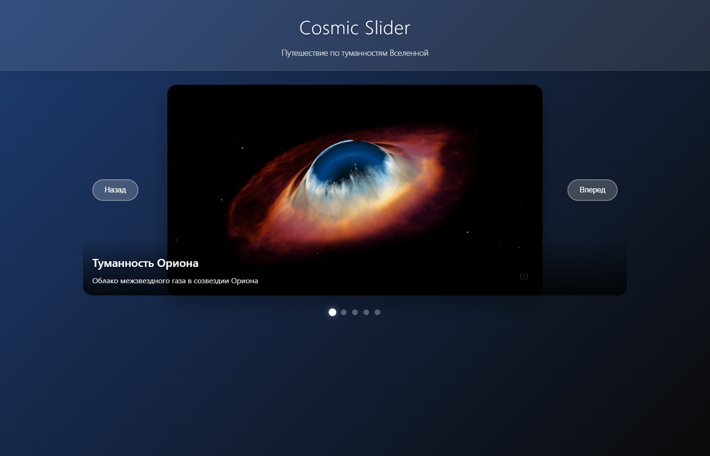
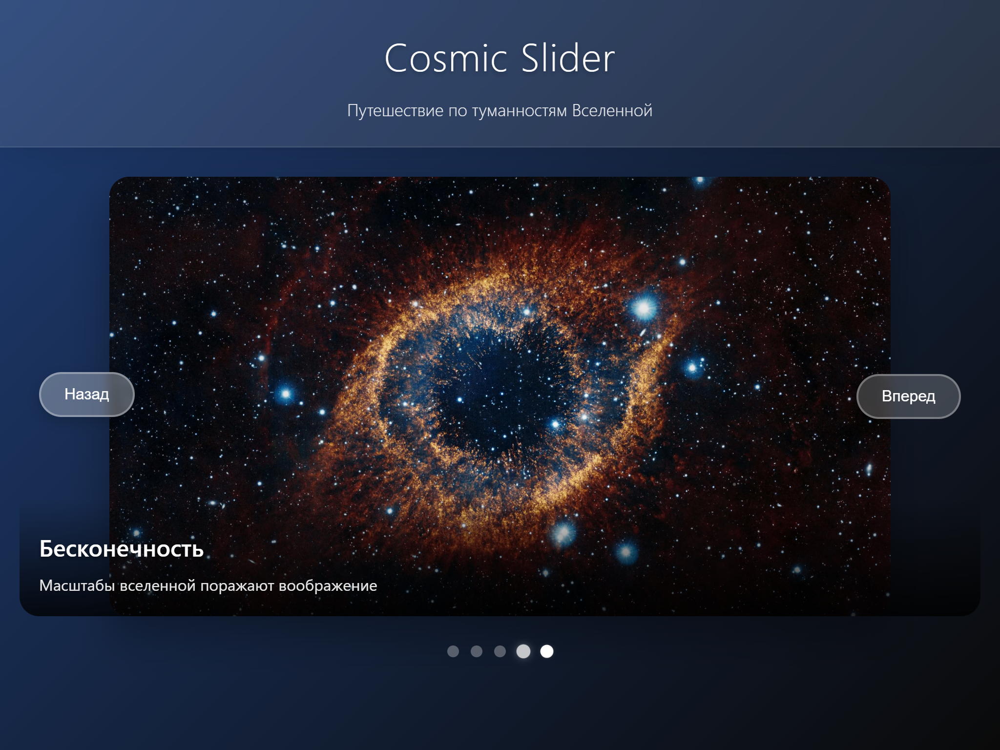
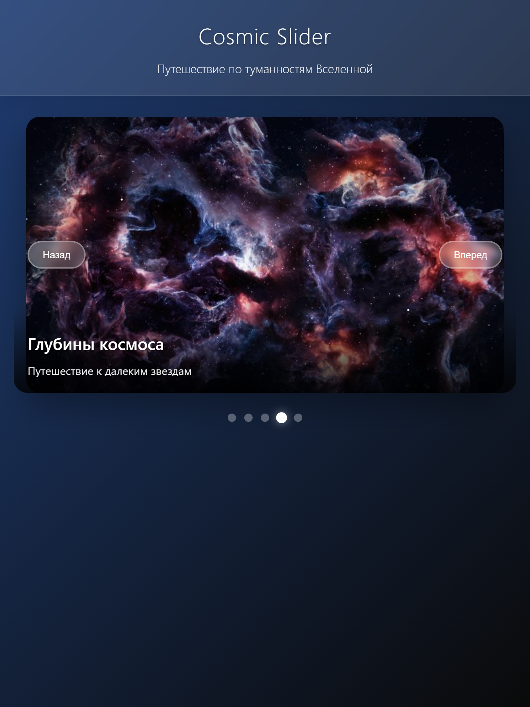
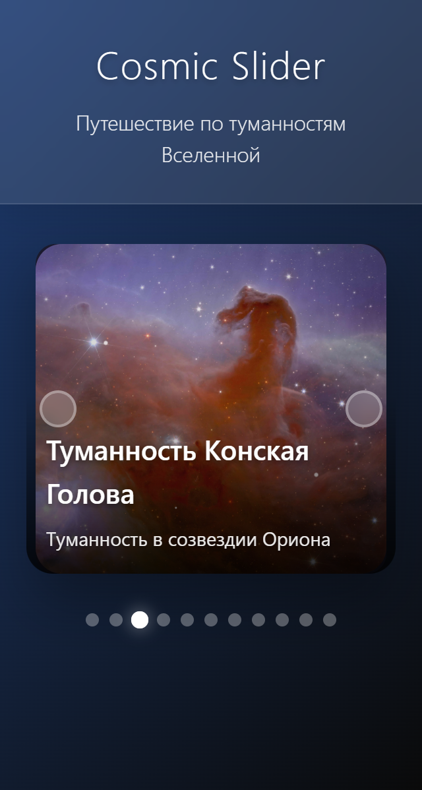

# 🌌 Cosmic Slider - Слайдер космических туманностей

[](https://developer.mozilla.org/ru/docs/Web/JavaScript)
[](https://developer.mozilla.org/ru/docs/Web/CSS)
[](https://developer.mozilla.org/ru/docs/Web/HTML)

## 🚀 Демо

**[Посмотреть живую демонстрацию](https://aluc2rd.github.io/Cosmic-Slider/)**



## ✨ Особенности

### 🎨 Визуальные эффекты

- **Плавные CSS анимации** с кастомными функциями плавности
- **Эффект стекла (glass morphism)** с backdrop-filter
- **Градиентные фоны** и тени для глубины
- **Адаптивный дизайн** для всех устройств
- **Космическая тематика** с эффектом звездной пыли

### ⚡ Функциональность

- **Автоплей** с настраиваемой задержкой
- **Touch-свайпы** для мобильных устройств
- **Управление с клавиатуры** (стрелки, пробел, Escape)
- **Предзагрузка изображений** с индикацией прогресса
- **Циклическая навигация** - бесконечный слайдер

### 🔧 Технические преимущества

- **Чистый JavaScript** (ES6+ классы)
- **Модульная архитектура** с разделением ответственности
- **Доступность (a11y)** - ARIA атрибуты, семантическая разметка
- **Обработка ошибок** с пользовательским интерфейсом

## 📱 Адаптивный дизайн

Проект идеально отображается на всех устройствах:

### 🖥️ Десктоп (1200px+)



**Особенности:**

- Полноразмерный слайдер 800x450px
- Боковые кнопки навигации
- Полная информация о туманности

### 💻 Ноутбук (850px - 1199px)



### 📟 Планшет (600px - 849px)



**Адаптации:**

- Уменьшенная высота слайдера (400px)
- Компактные кнопки управления
- Оптимизированные шрифты

### 📱 Мобильный (320px - 599px)



**Мобильные особенности:**

- Высота слайдера 250-300px
- Скрытый текст кнопок (только иконки)
- Упрощенная информация

### ⌨️ Управление

| Устройство    | Управление                       |
| ------------- | -------------------------------- |
| **Десктоп**   | Клики, клавиатура, ховер-эффекты |
| **Мобильные** | Тапы, свайпы, акселерометр       |
| **Все**       | Клавиатура: ← → Space Esc        |

## 🛠️ Установка и запуск

### Предварительные требования

- Веб-браузер с поддержкой ES6+
- Локальный сервер (рекомендуется)

### Быстрый старт

```bash
# Клонирование репозитория
git clone https://github.com/aluc2rd/Cosmic-Slider.git

# Переход в директорию
cd cosmic-explorer

# Запуск через локальный сервер
# Используйте Live Server в VS Code или:
python -m http.server 8000
# затем откройте http://localhost:8000
```
